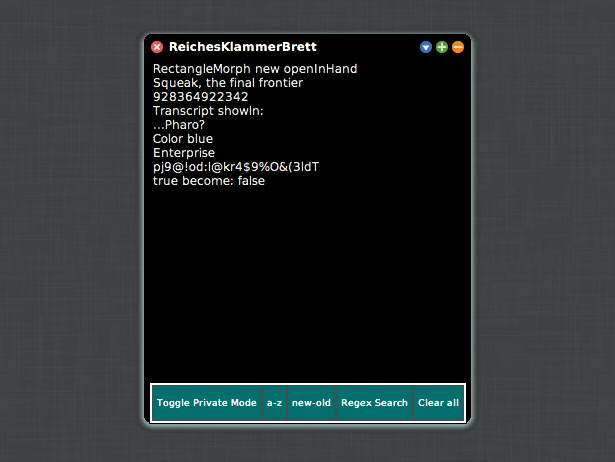

# RichClipboard


**RichClipboard** is a clipboard manager for Squeak which stores clipboard entries (clippings) to allow for further usage. It enhances the basic functions of cut, copy, and paste from the default clipboard in Squeak.



## Installation

1. Execute the following snippet in any text field to install the latest stable version of RichClipboard:
```
Metacello new
	baseline: 'RichClipboard';
	repository: 'github://hpi-swa-teaching/RichClipboard';
	load
```
2. Run `RichClipboard default openInWorld` to set up RichClipboard for the first time.
3. RichClipboard can subsequently be opened by selecting `RichClipboard` from Apps-Menu.

## Usage

- All entries that have been copied in Squeak will automatically be copied to RichClipboard.
- Click an entry to copy it back to the clipboard.
- The last 5 copied entries are accessible by the RichClipboard Context-Menu. This is accessed by pressing `ctrl+alt+v`.
- There are some additonal functionalities in RichClipboard which are a filtering function, a searching function and sorting functions.
  - Clicking `a-z` or `z-a` causes the entries to be sorted by ascending or descending alphabetical order and clicking `new-old` or `old-new` causes the entries to be sorted by the time they were copied to RichClipboard.
  - You can search for an entry or entries by typing the desired word into RichClipboard's window.
  - In order to search for an entry or entries based on a certain pattern (Regex), click `Regex Search` and type in the desired pattern.
  - It is also possible to have more than one RichClipboard window open at the same time so that one can apply different sorting, searching and filtering functionality in parallel.
- Clicking `Toggle Private Mode` toggles between private mode and default mode. In private mode, new clippings will not be stored in RichClipboard and clippings will disappear from the system clipboard after a short amount of time.
  - RichClipboard is in private mode if the suffix `(Private Mode)` is appended to the window title.
  
## Contributing

If you'd like to contribute, have a look in the [wiki](https://github.com/hpi-swa-teaching/RichClipboard/wiki), where we've set up a series of guidelines for development.

## History

This project was started in summer term 2020 as part of the Software Engineering course at HPI.

Contributers:  
Siddeshkanth Logonathan, Jeffrey Johnson, Leonard Seibold, Martin Graf, Daniel Woelki  
(swt20-14)
